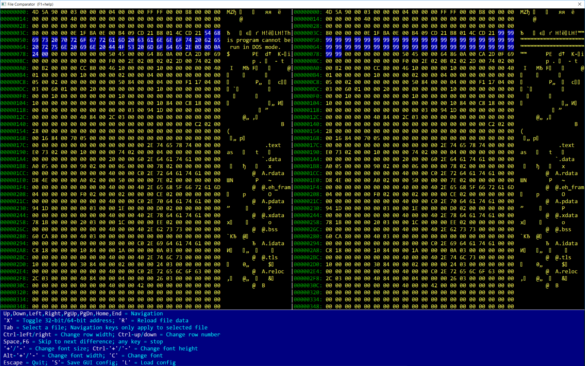

# cmp
Visual File Comparison utility



## Overview

**cmp** is a Windows-based visual hex file comparator that allows side-by-side comparison of up to 8 files simultaneously. It displays files in both hexadecimal and ASCII formats, highlighting differences between files in real-time.

## Features

- **Multi-file comparison**: Compare up to 8 files at once in a side-by-side layout
- **Hex and ASCII display**: View file contents in both hexadecimal and ASCII representations
- **Difference highlighting**: Automatically highlights bytes that differ between files
- **Difference scanning**: Quickly jump to the next difference in files
- **Configurable font**: Customize font type, size, width, and height
- **Flexible display**: Adjust number of bytes per row and number of rows displayed
- **32-bit/64-bit address support**: Toggle between 32-bit and 64-bit address display for large files (>4GB)
- **Persistent configuration**: Save and load GUI settings via registry
- **File reloading**: Refresh file data on demand
- **Mouse wheel support**: Navigate through files using the mouse wheel

## Keyboard Controls

### Navigation
- **Arrow Keys** (Up, Down, Left, Right): Navigate through the file
- **Page Up / Page Down**: Move one page up or down
- **Home**: Jump to beginning of file
- **End**: Jump to end of file
- **Mouse Wheel**: Scroll up or down

### File Selection
- **Tab**: Select next file (navigation keys only apply to the selected file when a specific file is selected)

### Display Configuration
- **Ctrl + Left / Right**: Decrease/increase row width (bytes per line)
- **Ctrl + Up / Down**: Decrease/increase number of rows displayed

### Font Configuration
- **+/-**: Increase/decrease overall font size
- **Ctrl + +/-**: Increase/decrease font height only
- **Alt + +/-**: Increase/decrease font width only
- **C**: Open font selection dialog

### File Operations
- **R**: Reload file data from disk
- **X**: Toggle between 32-bit and 64-bit address display

### Difference Scanning
- **Space** or **F6**: Skip to next difference between files (press any key to stop scanning)

### Configuration
- **S**: Save current GUI configuration to registry
- **L**: Load GUI configuration from registry

### Help and Exit
- **F1**: Toggle help text display at bottom of window
- **Escape**: Quit application

## Usage

### Command Line
```bash
cmp.exe <file1> [file2] [file3] ... [file8]
```

- Specify at least one file to open
- You can specify up to 8 files to compare simultaneously
- If only one file is specified, it will be displayed alone (useful for hex viewing)

### Examples
```bash
# Compare two files
cmp.exe file1.bin file2.bin

# Compare multiple files
cmp.exe v1.exe v2.exe v3.exe v4.exe

# View a single file in hex
cmp.exe data.bin
```

## Building

The project is designed for Windows and requires:
- Windows SDK
- C++ compiler with Windows API support
- Required libraries: GDI32, USER32, ADVAPI32, COMDLG32

See the source code for compilation details.

## Technical Details

- **Cache system**: Uses a 1MB file cache with 64KB alignment for efficient file access
- **Background scanning**: Difference scanning runs in a separate thread to keep UI responsive
- **Double buffering**: Uses offscreen bitmap rendering for flicker-free display
- **Color highlighting**: Differences are highlighted using a customizable color palette
- **Animated selection**: The selected file view is indicated with an animated dashed border

## License

See LICENSE file for details.
